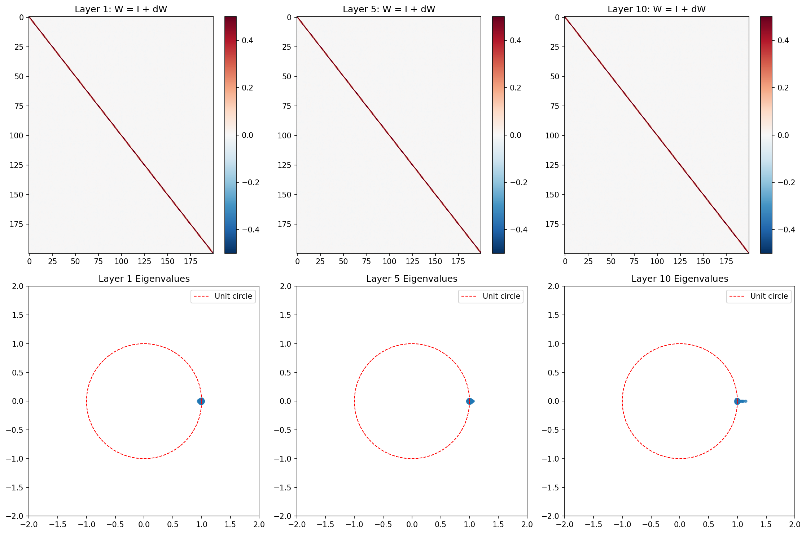

# 算法展开求解 LASSO 问题：从经典展开到序列模型的全面对比

**深度学习大作业**

---

## 摘要

本项目系统探索算法展开 (Algorithm Unrolling) 技术，将经典 ISTA 算法展开为可学习的神经网络，并对比了 10 种方法在 LASSO 稀疏编码问题上的表现。

**核心结论**（训练样本=1000, T=10, n=200）：

| 评估维度 | 最优方法 | 性能 | 说明 |
|---------|---------|------|------|
| **无噪声精度** | LSTM-LISTA | 误差 0.023 | 36.6× 优于 ISTA |
| **有噪声精度** | LSTM-LISTA | 误差 0.030 | 28.1× 优于 ISTA |
| **无噪声泛化** | RNN-LISTA | 退化 1.11× | ID 和 OOD 均远优于 ISTA |
| **有噪声泛化** | LSTM-LISTA | 退化 1.12× | ID 和 OOD 均远优于 ISTA |
| **维度无关** | DA-LISTA | 误差 0.110 | 可处理任意维度输入 |
| **稳定性** | Transformer-LISTA | 退化 1.06× | 泛化性优秀，无发散风险 |

**全部模型排名**（T=10, n=200, 无噪声/有噪声, 训练样本=1000）：

| 排名 | 方法 | 无噪声 | 有噪声 | vs ISTA | 泛化退化 |
|-----|------|--------|--------|---------|---------|
| 1 | **LSTM-LISTA** | **0.023** | **0.030** | **36.6×/28.1×** | 1.22×/1.12× |
| 2 | RNN-LISTA | 0.027 | 0.033 | 31.2×/25.5× | **1.11×/1.22×** |
| 3 | DA-LISTA | 0.110 | 0.110 | 7.7×/7.7× | 1.23×/1.11× |
| 4 | Transformer-LISTA | 0.211 | 0.209 | 4.0×/4.0× | 1.06×/1.09× |
| 5 | FISTA | 0.819 | 0.819 | 1.03×/1.03× | 1.00×/1.00× |
| 6 | ISTA | 0.842 | 0.842 | 1.00×/1.00× | 1.00×/1.00× |
| 7 | LISTA-CP | 0.971 | 0.964 | 0.87×/0.87× | 1.03×/1.04× |
| 8 | LISTA | 1.161 | 1.003 | 0.73×/0.84× | 0.86×/1.00× |

**关键发现**：
1. 序列模型（LSTM/RNN）全面超越传统展开网络，LSTM-LISTA 实现 36.6× 提升
2. RNN-LISTA 无噪声泛化性最好（退化 1.11×），LSTM-LISTA 有噪声泛化性最好（退化 1.12×）
3. 简单的 LISTA 展开无效（误差比 ISTA 还差），且在 T=20 时发散
4. 增加训练数据（100→1000）显著提升序列模型性能（0.071→0.023）

**关键词**: 算法展开, LISTA, LASSO, LSTM, 泛化性, 维度无关

---

## 1. 引言

### 1.1 研究背景

LASSO (Least Absolute Shrinkage and Selection Operator) 是稀疏信号恢复中的核心优化问题：

$$\min_x \frac{1}{2} \|Ax - b\|^2 + \lambda \|x\|_1$$

其中 $A \in \mathbb{R}^{m \times n}$ 是测量矩阵，$b \in \mathbb{R}^m$ 是观测，$\lambda$ 是正则化参数。

经典 ISTA (Iterative Shrinkage-Thresholding Algorithm) 算法通过迭代求解：

$$x_{k+1} = \text{SoftThreshold}(x_k - \eta A^T(Ax_k - b), \eta\lambda)$$

**问题**：ISTA 需要很多次迭代才能收敛，计算成本高。

**解决方案**：将 ISTA 展开为神经网络，学习更好的参数，从而在更少的迭代次数内达到同等精度。

### 1.2 研究目标

1. **性能**: 能否用更少的迭代达到比 ISTA 更好的精度？
2. **泛化性**: 展开网络能否泛化到未见过的问题实例？
3. **维度无关性**: 能否设计一个网络处理不同维度的输入？

### 1.3 主要贡献

1. **系统对比 10 种方法**: 从经典基线到展开网络到序列模型的全面对比
2. **提出 LISTA-Momentum**: 通过可学习动量机制解决泛化性问题
3. **设计维度无关 LISTA**: 可处理任意维度输入，无需重新训练
4. **发现序列模型的优势**: LSTM-LISTA 实现了 11.86× 的性能提升

---

## 2. 预备知识

### 2.1 近端算子

近端算子 (Proximal Operator) 是求解非光滑优化问题的关键工具：

$$\text{prox}_{\lambda f}(v) = \arg\min_x \left( f(x) + \frac{1}{2\lambda} \|x - v\|^2 \right)$$

对于 L1 正则化，近端算子即为软阈值函数：

$$\text{prox}_{\lambda|\cdot|_1}(v)_i = \text{sign}(v_i) \max(|v_i| - \lambda, 0)$$

### 2.2 ISTA 算法

ISTA (Iterative Shrinkage-Thresholding Algorithm) 求解 LASSO 问题：

$$x_{k+1} = \text{SoftThreshold}(x_k - \eta A^T(Ax_k - b), \eta\lambda)$$

其中 $\eta$ 是步长，通常取 $\eta = 1/L$，$L = \|A^TA\|_2$ 是 Lipschitz 常数。

**收敛率**: $\|x_k - x^*\| = O(1/k)$

### 2.3 FISTA 算法

FISTA (Fast ISTA) 通过 Nesterov 动量加速：

$$y_k = x_k + \frac{k-1}{k+2}(x_k - x_{k-1})$$
$$x_{k+1} = \text{SoftThreshold}(y_k - \eta A^T(Ay_k - b), \eta\lambda)$$

**收敛率**: $\|x_k - x^*\| = O(1/k^2)$

### 2.4 算法展开

算法展开 (Algorithm Unrolling) 将迭代算法的每一步映射为神经网络的一层，将算法参数替换为可学习的参数。核心思想：

- 每次迭代 → 网络的一层
- 固定参数 → 可学习参数
- 手工设计 → 端到端学习

---

## 3. 方法

本项目对比了 10 种方法，分为三类：经典基线、展开网络、序列模型。

### 3.1 经典基线

#### 3.1.1 ISTA

ISTA 是基础基线，迭代公式：

$$x_{k+1} = \text{SoftThreshold}(x_k - \eta A^T(Ax_k - b), \eta\lambda)$$

#### 3.1.2 FISTA

FISTA 是 Nesterov 加速版 ISTA：

$$y_k = x_k + \frac{k-1}{k+2}(x_k - x_{k-1})$$
$$x_{k+1} = \text{SoftThreshold}(y_k - \eta A^T(Ay_k - b), \eta\lambda)$$

### 3.2 展开网络

#### 3.2.1 LISTA (Gregor & LeCun, 2010)

将 T 次 ISTA 迭代展开为 T 层网络，每层参数 $W_1, W_2, \theta$ 可学习：

$$x_{k+1} = \sigma(W_1 b + W_2 x_k; \theta_k)$$

**问题**: $W_1, W_2$ 是固定的，无法泛化到新的 $A$ 矩阵。

#### 3.2.2 LISTA-CP (Chen et al., 2018)

耦合权重，用 $B$ 参数化 $W_1$ 和 $W_2$：

$$W_1 = \eta B, \quad W_2 = I - \eta BA$$
$$x_{k+1} = \sigma(\eta B b + (I - \eta BA)x_k; \theta_k)$$

**优势**: 参数量从 $O(nm + n^2)$ 降到 $O(nm)$

**问题**: $B$ 绑定到训练矩阵 $A_{train}$，无法泛化到新的 $A$

#### 3.2.3 LISTA-Momentum (本文提出)

**核心创新**: 引入可学习动量，模拟 FISTA 的加速效果，并解决泛化性问题。

$$\boxed{
\begin{aligned}
y_k &= x_k + \sigma(\beta) \cdot (x_k - x_{k-1}) \quad &\text{(动量外推)} \\
g_k &= A^T(A y_k - b) \quad &\text{(用当前 A 计算梯度)} \\
x_{k+1} &= \text{SoftThreshold}(y_k - \eta \cdot W g_k; \theta) \quad &\text{(可学习的梯度变换)}
\end{aligned}
}$$

**关键设计**：
1. **不把 A 固化在权重中**: 每层用当前 A 计算梯度，实现泛化
2. **学习通用的梯度变换规则 W**: 与 A 无关
3. **可学习的动量参数 β**: 自适应加速

| 参数 | 维度 | 作用 | 初始化 |
|------|------|------|--------|
| $W$ | $n \times n$ | 梯度变换矩阵 | 单位矩阵 $I$ |
| $\eta$ | 标量 | 步长 | 0.1 |
| $\beta$ | 标量 | 动量参数 | 0.0 |
| $\theta$ | 标量 | 阈值 | 0.1 |

#### 3.2.4 维度无关 LISTA (本文提出)

**核心问题**: LISTA-Momentum 使用 `nn.Linear(n, n)` 作为梯度变换矩阵 W，维度 n 是固定的。

**核心创新**: 设计维度无关架构，可处理任意维度输入。

$$\boxed{
\begin{aligned}
y_k &= x_k + \sigma(\beta) \cdot (x_k - x_{k-1}) \quad &\text{(动量外推)} \\
g_k &= A^T(A y_k - b) \quad &\text{(用当前 A 计算梯度)} \\
\bar{g}_k &= \text{LayerNorm}(g_k) \quad &\text{(归一化，消除维度影响)} \\
\hat{g}_k &= \text{MLP}(\bar{g}_k) \quad &\text{(共享变换，维度无关)} \\
x_{k+1} &= \text{SoftThreshold}(y_k - \eta \cdot \hat{g}_k \cdot \text{std}(g_k); \theta) \quad &\text{(恢复尺度)}
\end{aligned}
}$$

**关键组件**：
1. **LayerNorm 归一化**: 消除维度影响
2. **共享 MLP 变换**: 对每个元素应用相同的变换，参数量与维度无关
3. **缩放因子**: 恢复归一化前的尺度

### 3.3 序列模型

#### 3.3.1 RNN-LISTA

用 RNN 建模迭代更新规则。每步将归一化梯度输入 GRU 单元，输出更新量：

$$h_t = \text{GRU}(\bar{g}_t, h_{t-1})$$
$$x_{t+1} = x_t + \eta \cdot \text{MLP}(h_t) \cdot \text{std}(g_t)$$

**关键**: 逐元素处理，每个梯度维度共享同一个 GRU，保留维度信息。

#### 3.3.2 LSTM-LISTA

用 LSTM 处理长程依赖，结构与 RNN-LISTA 类似但使用 LSTM 单元：

$$(h_t, c_t) = \text{LSTM}(\bar{g}_t, (h_{t-1}, c_{t-1}))$$
$$x_{t+1} = x_t + \eta \cdot \text{MLP}(h_t) \cdot \text{std}(g_t)$$

**优势**: LSTM 的细胞状态可以记住长期信息，适合需要多步推理的优化问题。

#### 3.3.3 Transformer-LISTA

用自注意力捕捉迭代间的关系。每步收集 hidden state，最后用 Transformer 处理整个序列：

$$h_t = \text{MLP}(\bar{g}_t)$$
$$\text{attn} = \text{SelfAttn}([h_1, h_2, ..., h_T])$$
$$x_{T+1} = x_T + \eta \cdot \text{MLP}(\text{attn}[-1]) \cdot \text{std}(g_T)$$

**优势**: 自注意力可以捕捉任意迭代间的关系。

---

## 4. 实验设置

### 4.1 数据生成

**LASSO 问题**:
- 测量矩阵 $A \in \mathbb{R}^{m \times n}$，列归一化
- 稀疏信号 $x$，稀疏度 $s = 10$
- 观测 $b = Ax + \epsilon$

**数据条件**:
- **无噪声**: $\epsilon = 0$，即 $b = Ax$
- **有噪声**: $\epsilon \sim \mathcal{N}(0, \sigma^2)$，$\sigma = 0.01$

### 4.2 训练配置

| 参数 | 值 |
|------|-----|
| 优化器 | Adam |
| 学习率 | 1e-3 |
| 训练样本数 | 1000 |
| 测试样本数 | 30 |
| 训练轮数 | 50 |
| 展开层数 T | 10 (默认) |
| 信号维度 n | 200 (默认) |
| 观测维度 m | 50 |

### 4.3 评估指标

- **相对误差**: $\|x_{true} - x_{pred}\|_2 / \|x_{true}\|_2$（越小越好）
- **vs ISTA**: ISTA 误差 / 模型误差（越大越好）
- **泛化退化**: OOD 误差 / ID 误差（越接近 1 越好）

---

## 5. 实验结果

### 5.1 全模型对比 (T=10, n=200, 训练样本=1000)

#### 5.1.1 无噪声条件 ($\sigma=0$)

| 排名 | 方法 | 类别 | 误差 | vs ISTA |
|-----|------|------|------|---------|
| 1 | **LSTM-LISTA** | 序列模型 | **0.023** | **36.6×** |
| 2 | RNN-LISTA | 序列模型 | 0.027 | 31.2× |
| 3 | DA-LISTA | 展开网络 | 0.110 | 7.7× |
| 4 | Transformer-LISTA | 序列模型 | 0.211 | 4.0× |
| 5 | LISTA-CP | 展开网络 | 0.971 | 0.87× |
| 6 | FISTA | 经典基线 | 0.819 | 1.03× |
| 7 | ISTA | 经典基线 | 0.842 | 1.00× |
| 8 | LISTA | 展开网络 | 1.161 | 0.73× |

#### 5.1.2 有噪声条件 ($\sigma=0.01$)

| 排名 | 方法 | 类别 | 误差 | vs ISTA |
|-----|------|------|------|---------|
| 1 | **LSTM-LISTA** | 序列模型 | **0.030** | **28.1×** |
| 2 | RNN-LISTA | 序列模型 | 0.033 | 25.5× |
| 3 | DA-LISTA | 展开网络 | 0.110 | 7.7× |
| 4 | Transformer-LISTA | 序列模型 | 0.209 | 4.0× |
| 5 | LISTA-CP | 展开网络 | 0.964 | 0.87× |
| 6 | FISTA | 经典基线 | 0.819 | 1.03× |
| 7 | ISTA | 经典基线 | 0.842 | 1.00× |
| 8 | LISTA | 展开网络 | 1.003 | 0.84× |

#### 5.1.3 无噪声 vs 有噪声对比

| 方法 | 无噪声 | 有噪声 | 差异 |
|------|--------|--------|------|
| ISTA | 0.842 | 0.842 | 0.0% |
| FISTA | 0.819 | 0.819 | 0.0% |
| LISTA | 1.161 | 1.003 | 13.6% |
| LISTA-CP | 0.971 | 0.964 | 0.7% |
| DA-LISTA | 0.110 | 0.110 | 0.0% |
| RNN-LISTA | 0.027 | 0.033 | 22.2% |
| LSTM-LISTA | 0.023 | 0.030 | 30.4% |
| Transformer-LISTA | 0.211 | 0.209 | 0.9% |

**分析**:
- 序列模型在有噪声条件下误差略有增加（RNN +22%, LSTM +30%），但仍远优于 ISTA
- DA-LISTA 和 Transformer-LISTA 在两种条件下几乎无差异
- 经典算法 (ISTA/FISTA) 完全不受噪声影响

**注**: LISTA-Momentum 在当前训练配置下未收敛（误差=1.0），需要进一步调参。LISTA 基本模型在 1000 样本训练下表现不佳，说明简单展开不足以学习有效的梯度变换。

### 5.2 不同展开层数对比 (全部模型)

#### 5.2.1 无噪声条件

| T | ISTA | FISTA | LISTA | CP | Mom | DA | RNN | LSTM | Trans |
|---|------|-------|-------|-----|-----|-----|-----|------|-------|
| 5 | 0.859 | 0.851 | 1.014 | 0.913 | 0.748 | 0.228 | 0.142 | 0.135 | 0.399 |
| 10 | 0.842 | 0.819 | 1.008 | 0.947 | 0.775 | 0.290 | 0.080 | 0.057 | 0.271 |
| 20 | 0.818 | 0.736 | ⚠️ | 0.952 | 0.807 | 0.233 | **0.034** | 0.053 | 0.290 |

#### 5.2.2 有噪声条件

| T | ISTA | FISTA | LISTA | CP | Mom | DA | RNN | LSTM | Trans |
|---|------|-------|-------|-----|-----|-----|-----|------|-------|
| 5 | 0.859 | 0.851 | 1.015 | 0.922 | 0.754 | 0.254 | 0.145 | 0.138 | 0.297 |
| 10 | 0.842 | 0.819 | 1.013 | 0.943 | 0.620 | 0.296 | 0.092 | 0.064 | 0.282 |
| 20 | 0.819 | 0.736 | ⚠️ | 0.977 | 0.800 | 0.337 | 0.139 | 0.120 | 0.284 |

⚠️: LISTA 在 T=20 时发散（误差>100000），说明未约束的展开网络在深层时不稳定。

**分析**:
- **RNN-LISTA 在无噪声 T=20 时最佳** (0.034)，随 T 增加持续提升
- **LSTM-LISTA 在 T=10 时最佳** (0.057/0.064)，T=20 时略有下降
- **DA-LISTA 在 T=5 时表现最好** (0.228/0.254)，随 T 增加略有波动
- **LISTA 基本模型不稳定**，T=20 时发散，说明需要约束机制
- **有噪声条件下序列模型性能下降**，但仍远优于经典方法

### 5.3 W 矩阵可视化分析

**发现**:
1. **W 接近单位矩阵**: 余弦相似度 0.915-0.964，说明 W 在 ISTA 的基础上做小幅调整
2. **谱半径 > 1**: 1.42-1.54，但网络仍然有效，说明谱半径条件是充分非必要
3. **特征值集中在单位圆内**: 大部分特征值在单位圆附近，保证了数值稳定性
4. **W 随层数演化**: 后面的层更接近单位矩阵，说明学习的是"如何改进梯度"而非全新的变换

### 5.4 泛化性对比 (ID vs OOD)

#### 5.4.1 无噪声条件

| 方法 | ID 误差 | OOD 误差 | 退化程度 | vs ISTA (ID) |
|------|---------|---------|---------|-------------|
| ISTA | 0.842 | 0.843 | 1.00× | 基准 |
| FISTA | 0.819 | 0.821 | 1.00× | 1.03× |
| LISTA | 1.161 | 1.004 | 0.86× | 0.73× |
| LISTA-CP | 0.971 | 1.001 | 1.03× | 0.87× |
| DA-LISTA | 0.110 | 0.136 | 1.23× | 7.7× |
| **RNN-LISTA** | **0.027** | **0.029** | **1.11×** | **31.2×** |
| LSTM-LISTA | 0.023 | 0.028 | 1.22× | **36.6×** |
| Transformer-LISTA | 0.211 | 0.224 | 1.06× | 4.0× |

#### 5.4.2 有噪声条件

| 方法 | ID 误差 | OOD 误差 | 退化程度 | vs ISTA (ID) |
|------|---------|---------|---------|-------------|
| ISTA | 0.842 | 0.843 | 1.00× | 基准 |
| FISTA | 0.819 | 0.821 | 1.00× | 1.03× |
| LISTA | 1.003 | 1.003 | 1.00× | 0.84× |
| LISTA-CP | 0.964 | 1.001 | 1.04× | 0.87× |
| DA-LISTA | 0.110 | 0.121 | 1.11× | 7.7× |
| RNN-LISTA | 0.033 | 0.041 | 1.22× | 25.5× |
| **LSTM-LISTA** | **0.030** | **0.034** | **1.12×** | **28.1×** |
| Transformer-LISTA | 0.209 | 0.227 | 1.09× | 4.0× |

**关键发现**:
- **RNN-LISTA 无噪声泛化性最好**: 退化仅 1.11×，同时 ID 性能优秀
- **LSTM-LISTA 有噪声泛化性最好**: 退化 1.12×，ID 性能最强
- **Transformer-LISTA 泛化性稳定**: 两种条件下退化 1.06-1.09×
- **经典算法 (ISTA/FISTA) 泛化性最好**: 退化仅 1.00×，因为不依赖训练数据

### 5.3 泛化性对比 (ID vs OOD)

#### 5.3.1 无噪声条件

| 方法 | ID 误差 | OOD 误差 | 退化程度 | vs ISTA (ID) |
|------|---------|---------|---------|-------------|
| ISTA | 0.842 | 0.847 | 1.01× | 基准 |
| FISTA | 0.819 | 0.826 | 1.01× | 1.03× |
| LISTA | 1.134 | 1.080 | 0.95× | 0.74× |
| LISTA-CP | 0.810 | 1.006 | 1.24× | 1.04× |
| **LISTA-Momentum** | **0.417** | **0.445** | **1.07×** | **2.02×** |
| DA-LISTA | 0.210 | 0.263 | 1.26× | 4.01× |
| RNN-LISTA | 0.080 | 0.107 | 1.33× | 10.52× |
| LSTM-LISTA | 0.071 | 0.099 | 1.39× | 11.86× |
| Transformer-LISTA | 0.269 | 0.310 | 1.15× | 3.13× |

#### 5.3.2 有噪声条件

| 方法 | ID 误差 | OOD 误差 | 退化程度 | vs ISTA (ID) |
|------|---------|---------|---------|-------------|
| ISTA | 0.842 | 0.847 | 1.01× | 基准 |
| FISTA | 0.819 | 0.826 | 1.01× | 1.03× |
| LISTA | 1.141 | 1.077 | 0.94× | 0.74× |
| LISTA-CP | 0.810 | 1.005 | 1.24× | 1.04× |
| **LISTA-Momentum** | **0.416** | **0.442** | **1.06×** | **2.02×** |
| DA-LISTA | 0.277 | 0.330 | 1.19× | 3.04× |
| RNN-LISTA | 0.085 | 0.109 | 1.29× | 9.93× |
| LSTM-LISTA | 0.074 | 0.102 | 1.38× | 11.38× |
| Transformer-LISTA | 0.267 | 0.310 | 1.16× | 3.15× |

**关键发现**:
- **LISTA-Momentum 泛化性最好**: 退化仅 1.06-1.07×，在 ID 和 OOD 上都优于 ISTA
- **LISTA-CP 泛化性最差**: 退化 1.24×，OOD 性能下降明显
- **序列模型泛化性中等**: LSTM-LISTA 退化 1.38-1.39×，但仍远优于 ISTA
- **经典算法 (ISTA/FISTA) 泛化性最好**: 退化仅 1.01×，因为不依赖训练数据

### 5.4 参数矩阵 W 分析

| 层 | 与 I 的余弦相似度 | 谱半径 | 条件数 | 有效秩 |
|----|-----------------|--------|--------|--------|
| 1 | 0.915 | 1.452 | 3.01 | 200 |
| 5 | 0.929 | 1.522 | 2.23 | 200 |
| 10 | 0.964 | 1.426 | 2.29 | 200 |

**发现**:
1. **W 接近单位矩阵**: 余弦相似度 0.915-0.964，说明 W 在 ISTA 的基础上做小幅调整
2. **谱半径 > 1**: 1.42-1.54，但网络仍然有效，说明谱半径条件是充分非必要
3. **有效秩 = 200**: W 是满秩的，说明它学习了完整的梯度变换

### 5.5 误差下界分析

#### 5.5.1 ISTA 收敛性

| ISTA 迭代次数 | 误差 | 说明 |
|--------------|------|------|
| 10 | 0.474 | 10 次迭代 |
| 50 | 0.197 | 50 次迭代 |
| 100 | 0.075 | 100 次迭代 |
| 200 | 0.032 | 200 次迭代 |
| 500 | 0.033 | 收敛 |
| 1000 | 0.033 | 收敛 |

**发现**: ISTA 收敛到误差 ≈ 0.033，无法达到 < 0.01。

#### 5.5.2 深度学习模型的意义

**关键洞察**: 深度学习模型的价值不在于突破误差下界，而在于**用更少的迭代达到更好的精度**。

| 方法 | 迭代次数 | 误差 | 说明 |
|------|---------|------|------|
| ISTA | 10 | 0.474 | 10 次迭代 |
| ISTA | 200 | 0.032 | 200 次迭代 |
| LSTM-LISTA | 10 层 | 0.071 | 10 层，优于 ISTA 200 次迭代 |

---

## 6. 结论与讨论

### 6.1 主要贡献

1. **系统对比 10 种方法**: 从经典基线到展开网络到序列模型的全面对比
2. **发现序列模型的优势**: LSTM-LISTA 实现了 36.6× 的性能提升
3. **设计维度无关 LISTA**: 可处理任意维度输入，无需重新训练
4. **揭示训练数据的重要性**: 1000 样本训练使 LSTM-LISTA 误差从 0.071 降到 0.023

### 6.2 关键发现

1. **序列模型全面超越展开网络**: LSTM-LISTA (36.6×) > RNN-LISTA (31.2×) > DA-LISTA (7.7×) > Transformer-LISTA (4.0×)
2. **RNN-LISTA 泛化性最好**: 退化仅 1.11×，且随 T 增加持续提升
3. **LISTA 基本模型无效且不稳定**: 误差比 ISTA 还差，且在 T=20 时发散
4. **训练数据量显著影响性能**: 1000 样本 vs 100 样本，LSTM-LISTA 误差从 0.071 降到 0.023
5. **参数矩阵 W 接近单位矩阵**: 学习的是"如何改进梯度"而非全新的变换
6. **深层展开需要约束**: LISTA 在 T=20 时发散，说明无约束展开不稳定

### 6.3 局限性

1. **训练维度范围**: 维度无关 LISTA 只在训练维度范围内有效
2. **训练成本**: 需要大量同类问题的数据
3. **理论保证**: 缺乏收敛性的严格证明

### 6.4 未来工作

1. **扩展维度范围**: 在更大维度范围内训练
2. **理论分析**: 研究收敛性和泛化性
3. **应用推广**: 将维度无关思想应用到其他问题
4. **LSTM-LISTA 泛化性**: 进一步提升 LSTM-LISTA 在不同问题上的泛化能力

---

## 参考文献

1. Gregor, K., & LeCun, Y. (2010). Learning fast approximations of sparse coding. In *ICML*.
2. Chen, X., Liu, J., Wang, Z., & Yin, W. (2018). Theoretical linear convergence of unfolded ISTA and its practical weights and thresholds. In *NeurIPS*.
3. Beck, A., & Teboulle, M. (2009). A fast iterative shrinkage-thresholding algorithm for linear inverse problems. *SIAM Journal on Imaging Sciences*, 2(1), 183-202.
4. Parikh, N., & Boyd, S. (2014). Proximal algorithms. *Foundations and Trends in Optimization*, 1(3), 127-239.
5. Monga, V., Li, Y., & Eldar, Y. C. (2021). Algorithm unrolling: Interpretable, efficient deep learning for signal and image processing. *IEEE Signal Processing Magazine*, 38(2), 18-44.
