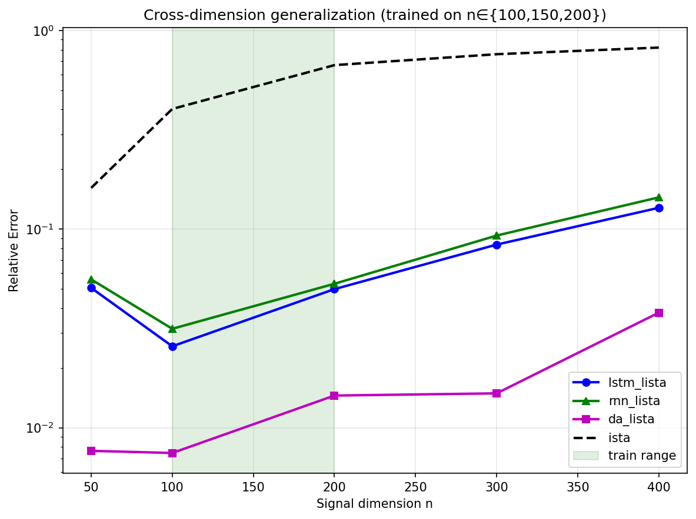
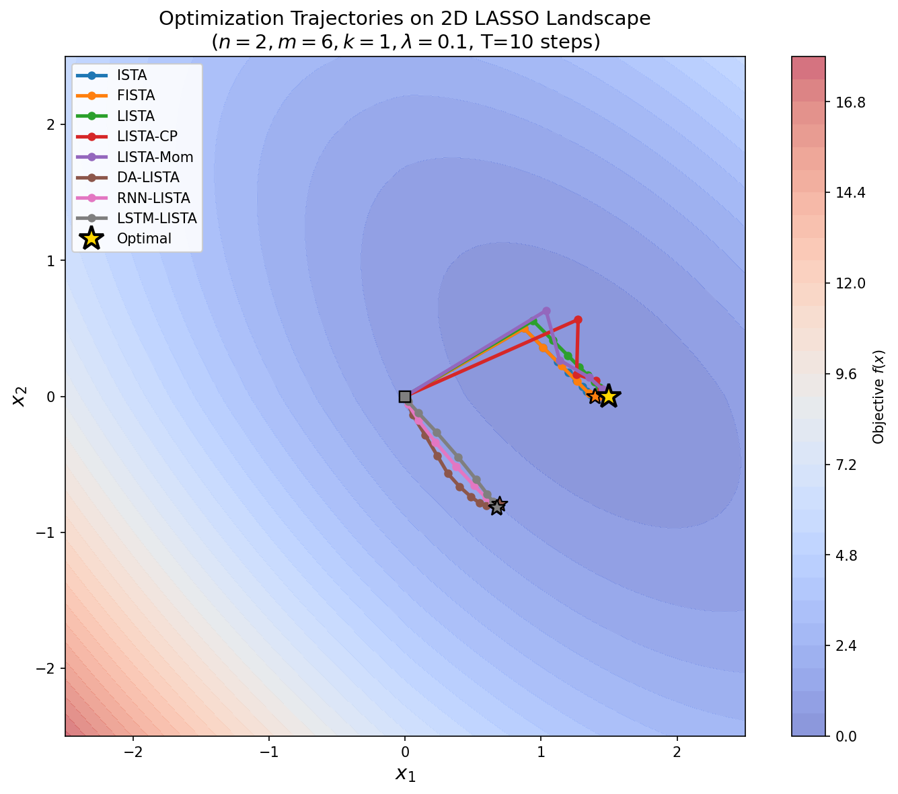
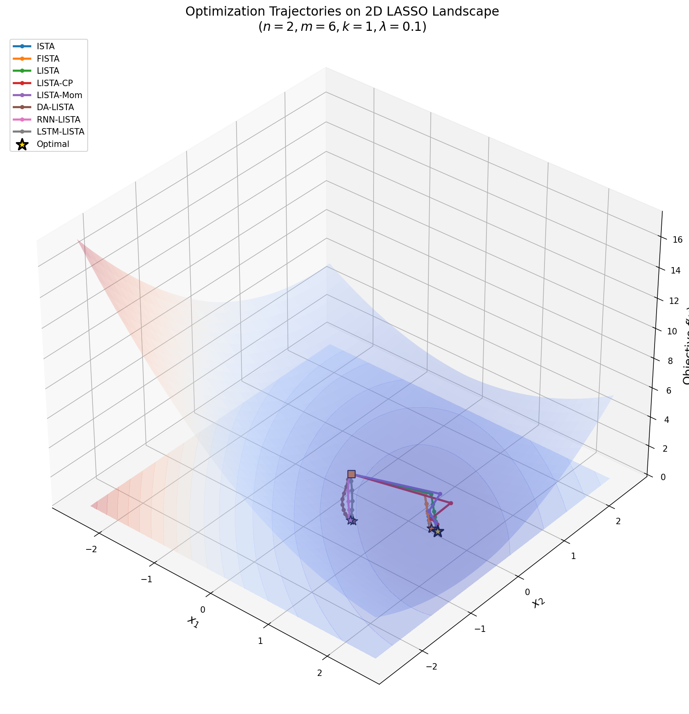

# 算法展开求解 LASSO 问题：从经典展开到序列模型的全面对比

**深度学习大作业**

---

## 摘要

本项目系统探索算法展开 (Algorithm Unrolling) 技术在 LASSO 稀疏编码问题上的应用，对比了 9 种方法：经典基线 (ISTA/FISTA)、展开网络 (LISTA/LISTA-CP/LISTA-Momentum)、维度无关架构 (DA-LISTA) 和序列模型 (RNN-LISTA/LSTM-LISTA/Transformer-LISTA)。

**核心结论**（T=10, m=100, n=200, k=5, 训练样本=1000, 3 种子, 均值±标准差）：

| 排名 | 方法 | 无噪声误差 | vs ISTA | 泛化退化 |
|-----|------|-----------|---------|---------|
| 1 | **DA-LISTA** | **0.010±0.000** | **68.8×** | 1.01× |
| 2 | Transformer-LISTA | 0.016±0.003 | 40.5× | 1.21× |
| 3 | RNN-LISTA | 0.047±0.001 | 14.0× | 1.07× |
| 4 | LSTM-LISTA | 0.050±0.006 | 13.1× | 1.04× |
| 5 | FISTA | 0.567±0.005 | 1.16× | 1.02× |
| 6 | LISTA-Momentum | 0.662±0.004 | 0.99× | 1.01× |
| 7 | ISTA | 0.657±0.005 | 1.00× | 1.01× |
| 8 | LISTA-CP | 0.691±0.002 | 0.95× | 1.86× |
| 9 | LISTA | 0.743±0.014 | 0.88× | 1.90× |

**关键发现**：
1. **序列模型全面超越展开网络和经典方法**：DA-LISTA 实现 68.8× 提升，Transformer 40.5×
2. **DA-LISTA 跨维度泛化能力突出**：在训练范围外的 n=400 上误差仅 0.038，而 ISTA 为 0.819
3. **LISTA/CP 在固定字典设定下仍无法超越 ISTA**：展开网络的学习优势在该问题规模下未体现
4. **LISTA-Momentum 的 OOD 退化最小 (1.01×)，但绝对精度未超越 ISTA (0.662 vs 0.657)**：退化小是因为它每层用当前 A 计算梯度、不把 A 固化在权重中，但这也意味着其精度瓶颈不在泛化而在学习本身

**关键词**: 算法展开, LISTA, LASSO, LSTM, 维度无关, 泛化性

---

## 1. 引言

### 1.1 研究背景

LASSO (Least Absolute Shrinkage and Selection Operator) 是稀疏信号恢复中的核心优化问题：

$$\min_x \frac{1}{2} \|Ax - b\|^2 + \lambda \|x\|_1$$

其中 $A \in \mathbb{R}^{m \times n}$ 是测量矩阵，$b \in \mathbb{R}^m$ 是观测，$\lambda$ 是正则化参数。

经典 ISTA (Iterative Shrinkage-Thresholding Algorithm) 通过迭代求解：

$$x_{k+1} = \text{SoftThreshold}(x_k - \eta A^T(Ax_k - b), \eta\lambda)$$

**算法展开** (Monga et al., 2021) 将迭代算法的每一步映射为神经网络的一层，将固定参数替换为可学习参数，目标是在固定迭代次数内获得更好的精度。

### 1.2 研究目标

1. **性能**: 展开网络能否在固定迭代次数 T 内超越经典 ISTA/FISTA？
2. **泛化性**: 学习型方法能否泛化到未见过的问题实例和维度？
3. **架构设计**: 不同的展开架构 (矩阵/耦合/动量/维度无关/序列) 各有何优劣？

### 1.3 主要贡献

1. **系统对比 9 种方法**：从经典基线到展开网络到序列模型的全面对比
2. **发现序列模型的压倒性优势**：DA-LISTA 和 Transformer-LISTA 在固定 T=10 下实现 40-69× 提升
3. **验证维度无关架构的有效性**：DA-LISTA 在 n=50 到 n=400 的范围内均保持低误差
4. **揭示展开网络的局限性**：LISTA/LISTA-CP 在固定字典设定下未能超越 ISTA

---

## 2. 预备知识

### 2.1 近端算子与软阈值

L1 正则化的近端算子即为软阈值函数：

$$\text{prox}_{\lambda|\cdot|_1}(v)_i = \text{sign}(v_i) \max(|v_i| - \lambda, 0)$$

本项目使用 softplus 约束阈值非负：$\theta = \text{softplus}(\rho) \geq 0$，避免自由参数变负导致退化。

### 2.2 ISTA 与 FISTA

**ISTA** 的收敛率为 $O(1/k)$，**FISTA** (Beck & Teboulle, 2009) 通过 Nesterov 动量加速至 $O(1/k^2)$：

$$t_{k+1} = \frac{1 + \sqrt{1 + 4t_k^2}}{2}, \quad y_k = x_k + \frac{t_k - 1}{t_{k+1}}(x_k - x_{k-1}), \quad x_{k+1} = \text{SoftThreshold}(y_k - \eta A^T(Ay_k - b), \eta\lambda)$$

### 2.3 算法展开

算法展开的核心思想：
- 每次迭代 → 网络的一层
- 固定参数 → 可学习参数
- 手工设计 → 端到端学习

关键问题：**初始化策略**。本项目采用 ISTA 等价初始化 (Gregor & LeCun, 2010)：

$$W_1 = \eta A^T, \quad W_2 = I - \eta A^T A, \quad \eta = 1/L, \quad L = \|A^T A\|_2$$

使网络初始即等价于 ISTA，训练只在此基础上改进。

---

## 3. 方法

### 3.1 经典基线

**ISTA**：基础近端梯度下降，$x_{k+1} = \text{SoftThreshold}(x_k - \eta A^T(Ax_k - b), \eta\lambda)$

**FISTA**：Nesterov 加速版 ISTA，收敛率 $O(1/k^2)$，通过序列 $t_{k+1} = (1+\sqrt{1+4t_k^2})/2$ 计算动量系数 $(t_k-1)/t_{k+1}$

### 3.2 展开网络

#### 3.2.1 LISTA (Gregor & LeCun, 2010)

将 T 次 ISTA 迭代展开为 T 层网络，每层参数 $W_1, W_2, \theta$ 可学习：

$$x_{k+1} = \sigma(W_1 b + W_2 x_k; \theta_k)$$

$W_1 \in \mathbb{R}^{n \times m}$, $W_2 \in \mathbb{R}^{n \times n}$ 独立学习，参数量 $O(nm + n^2)$。

#### 3.2.2 LISTA-CP (Chen et al., 2018)

耦合权重，用 $B \in \mathbb{R}^{n \times m}$ 参数化：

$$W_1 = \eta B, \quad W_2 = I - \eta BA, \quad x_{k+1} = \sigma(\eta Bb + (I - \eta BA)x_k; \theta_k)$$

参数量从 $O(nm + n^2)$ 降到 $O(nm)$，$B$ 初始化为 $A^T$。

#### 3.2.3 LISTA-Momentum

引入可学习动量，模拟 FISTA 的加速效果：

$$y_k = x_k + \sigma(\beta) \cdot (x_k - x_{k-1})$$
$$g_k = A^T(A y_k - b)$$
$$x_{k+1} = \text{SoftThreshold}(y_k - \eta \cdot (I + \Delta W) g_k; \theta)$$

**关键设计**：梯度变换采用残差形式 $(I + \Delta W)$，$\Delta W$ 零初始化，初始即 ISTA 步。

### 3.3 维度无关架构

#### 3.3.1 DA-LISTA

DA-LISTA 与 LISTA-Momentum 共享相同的迭代框架（动量外推 + 梯度变换），区别在于梯度变换部分用逐元素共享 MLP 替代固定 $n \times n$ 矩阵：

$$\boxed{
\begin{aligned}
y_k &= x_k + \sigma(\beta) \cdot (x_k - x_{k-1}) \quad &\text{(动量外推)} \\
g_k &= A^T(A y_k - b) \quad &\text{(用当前 A 计算梯度)} \\
\bar{g}_k &= (g_k - \mu_k) / \sigma_k \quad &\text{(逐坐标标准化，$\mu_k, \sigma_k$ 为坐标内统计量，无可学习参数)} \\
\hat{g}_k &= (\text{MLP}(\bar{g}_k) + \bar{g}_k) \cdot \sigma_k \cdot \alpha \quad &\text{(共享 MLP + 残差 + 尺度恢复)} \\
x_{k+1} &= \text{SoftThreshold}(y_k - \eta \cdot \hat{g}_k; \theta) \quad &\text{(软阈值)}
\end{aligned}
}$$

MLP 仅作用于单个元素 (Linear(1,h)→GELU→Linear(h,h)→GELU→Linear(h,1))，参数量与维度 n 无关。可学习参数包括 MLP 权重、步长 $\eta$、动量 $\beta$、缩放 $\alpha$、阈值 $\theta$。

### 3.4 序列模型

#### 3.4.1 RNN-LISTA / LSTM-LISTA

用 GRU/LSTM 建模迭代更新规则。每步将归一化梯度输入循环单元：

$$h_t = \text{GRU/LSTM}(\bar{g}_t, h_{t-1}), \quad x_{t+1} = x_t + \eta \cdot \text{MLP}(h_t) \cdot \text{std}(g_t)$$

逐元素处理，每个梯度维度共享同一个循环单元，保留维度信息。

#### 3.4.2 Transformer-LISTA

用自注意力捕捉迭代间的关系：

$$h_t = \text{MLP}(\bar{g}_t), \quad \text{attn} = \text{SelfAttn}([h_1, ..., h_T]), \quad x_{T+1} = x_T + \eta \cdot \text{MLP}(\text{attn}[-1]) \cdot \text{std}(g_T)$$

---

## 4. 实验设置

### 4.1 数据生成

**LASSO 问题**：
- 测量矩阵 $A \in \mathbb{R}^{100 \times 200}$，列归一化 (well-posed 区: m/n=0.5)
- 稀疏信号 $x$，稀疏度 $k=5$ (满足可恢复条件 $k < m/2$)
- 观测 $b = Ax + \epsilon$

**数据条件**：
- **无噪声**: $\epsilon = 0$
- **有噪声**: $\epsilon \sim \mathcal{N}(0, 0.01^2)$

**字典设定**：
- 固定字典模型 (LISTA/CP/Momentum)：所有训练样本共用同一个 A（标准算法展开设定）
- 变字典模型 (DA/序列)：每个样本携带各自随机生成的 A（体现跨 A 泛化）

### 4.2 训练配置

| 参数 | 值 | 说明 |
|------|-----|------|
| 优化器 | Adam | lr=1e-3 |
| 训练样本数 | 1000 | 固定字典模型共用同一 A |
| 测试样本数 | 100 | 与训练 A 不同的测试 A |
| 最大训练轮数 | 50 | 实际由早停决定 (见下) |
| 验证集比例 | 15% | 从训练集中划分 |
| 早停策略 | patience=15 | 验证 MSE 连续 15 轮无改善即停，回滚最优权重 |
| 展开层数 T | 10 (默认) | 对比 T∈{5,10,20} |
| 信号维度 n | 200 | m/n=0.5, well-posed |
| 观测维度 m | 100 | |
| 稀疏度 k | 5 | 远小于 m，可恢复 |
| 多种子 | 3 | seeds=[42, 123, 2024] |
| 梯度裁剪 | max_norm=1.0 | 防止梯度爆炸 |

**ISTA 等价初始化**：LISTA/CP/Momentum 的 $W_1 = \eta A^T$, $W_2 = I - \eta A^T A$, $\eta = 1/\|A^T A\|_2$，使网络初始即达到经典 ISTA 水平。

**字典模型训练差异说明**：
- 固定字典模型 (LISTA/CP/Momentum)：所有训练/验证样本共用同一个字典 $A$（标准算法展开设定，Gregor & LeCun, 2010），训练目标为 MSE($\hat{x}$, $x_{\text{true}}$)。
- 变字典模型 (DA/序列)：每个样本携带各自随机生成的 $A$（体现跨 A 泛化），按维度分组训练。
- 经典基线 (ISTA/FISTA)：无需训练，求解 LASSO 目标 $\min_x \frac{1}{2}\|Ax-b\|^2 + \lambda\|x\|_1$，$\lambda = 0.01 \cdot \max|A^T b|$。
- 所有方法统一用相对误差 $\|x_{\text{true}} - \hat{x}\|_2 / \|x_{\text{true}}\|_2$ 评估，不依赖各自目标函数值。

### 4.3 模型参数量

| 方法 | 类别 | 参数量 | 说明 |
|------|------|--------|------|
| ISTA | 经典基线 | 0 | 无学习参数 |
| FISTA | 经典基线 | 0 | 无学习参数 |
| LISTA | 展开网络 | 600,010 | $W_1 \in \mathbb{R}^{n \times m}$, $W_2 \in \mathbb{R}^{n \times n}$ ×T 层 |
| LISTA-CP | 展开网络 | 200,020 | $B \in \mathbb{R}^{n \times m}$ + 标量 η,θ ×T 层 |
| LISTA-Momentum | 展开网络 | 400,030 | $\Delta W \in \mathbb{R}^{n \times n}$ + 标量 η,β,θ ×T 层 |
| DA-LISTA | 维度无关 | 11,570 | 共享 MLP(1→32→32→1) + 标量 η,β,α,θ ×T 层 |
| RNN-LISTA | 序列模型 | 4,450 | GRU(1→32) + MLP head + 标量 η |
| LSTM-LISTA | 序列模型 | 5,570 | LSTM(1→32) + MLP head + 标量 η |
| Transformer-LISTA | 序列模型 | 5,378 | MLP(1→32) + SelfAttn + MLP head + 标量 η |

**分析**：
- LISTA 参数量最大 (60 万)，是 DA-LISTA 的 52 倍、RNN-LISTA 的 135 倍
- 序列模型 (RNN/LSTM/Transformer) 以最少参数 (4.5K~5.6K) 实现最优精度，体现了逐元素共享架构的参数效率
- DA-LISTA 参数量 (11.6K) 是序列模型的 2 倍，但其核心优势在于维度无关性（可跨维度推理），而非参数量少
- LISTA-CP 通过耦合权重将参数量从 LISTA 的 60 万降到 20 万

### 4.4 评估指标

- **相对误差**: $\|x_{\text{true}} - x_{\text{pred}}\|_2 / \|x_{\text{true}}\|_2$（越小越好）
- **vs ISTA**: ISTA 误差 / 模型误差（越大越好）
- **泛化退化**: OOD 误差 / ID 误差（越接近 1 越好）

### 4.5 推理时间对比

batch=32，T=10，n=200，CPU 取 50 次平均，GPU 取 100 次平均（含 CUDA 同步）。经典方法仅 CPU（numpy 循环）。

| 方法 | CPU (ms) | GPU (ms) | GPU 加速比 | 无噪声误差 | 参数量 |
|------|---------|---------|-----------|-----------|--------|
| LISTA | **1.51** | 2.17 | 0.7× | 0.743 | 600K |
| LISTA-CP | **1.71** | 2.63 | 0.7× | 0.691 | 200K |
| LISTA-Momentum | 5.31 | 3.61 | 1.5× | 0.662 | 400K |
| DA-LISTA | 12.46 | **6.66** | 1.9× | **0.010** | 11.6K |
| RNN-LISTA | 20.40 | 5.46 | 3.7× | 0.047 | 4.5K |
| LSTM-LISTA | 25.81 | 5.18 | 5.0× | 0.050 | 5.6K |
| Transformer-LISTA | 152.48 | **9.73** | **15.7×** | **0.016** | 5.4K |
| ISTA | 165.71 | — | — | 0.657 | 0 |
| FISTA | 169.27 | — | — | 0.567 | 0 |

*GPU: NVIDIA GeForce RTX 4060 Laptop*

**分析**：
- **GPU 对 Transformer 加速最显著**（15.7×），因自注意力可并行化；CPU 上它接近 ISTA 的速度，GPU 上降至 9.7ms
- **LISTA/CP 在 CPU 上已极快**（~2ms），GPU 反而略慢——小 batch 的 GPU 启动开销超过了计算收益
- **DA-LISTA 综合最优**：精度最高 (0.010)、参数最少 (11.6K)、GPU 推理 6.7ms
- **RNN/LSTM 的 GPU 加速 4-5×**，因 GRU/LSTM 的矩阵运算可并行
- 经典方法 (ISTA/FISTA) 最慢（~170ms），因 Python 逐样本循环无法并行

---

## 5. 实验结果

### 5.1 全模型对比 (T=10, m=100, n=200, k=5)

#### 5.1.1 无噪声条件

| 排名 | 方法 | 类别 | 误差 (mean±std) | vs ISTA |
|-----|------|------|----------------|---------|
| 1 | **DA-LISTA** | 维度无关 | **0.010±0.000** | **68.8×** |
| 2 | Transformer-LISTA | 序列模型 | 0.016±0.003 | 40.5× |
| 3 | RNN-LISTA | 序列模型 | 0.047±0.001 | 14.0× |
| 4 | LSTM-LISTA | 序列模型 | 0.050±0.006 | 13.1× |
| 5 | FISTA | 经典基线 | 0.567±0.005 | 1.16× |
| 6 | ISTA | 经典基线 | 0.657±0.005 | 1.00× |
| 7 | LISTA-Momentum | 展开网络 | 0.662±0.004 | 0.99× |
| 8 | LISTA-CP | 展开网络 | 0.691±0.002 | 0.95× |
| 9 | LISTA | 展开网络 | 0.743±0.014 | 0.88× |

#### 5.1.2 有噪声条件 ($\sigma=0.01$)

| 排名 | 方法 | 类别 | 误差 (mean±std) | vs ISTA |
|-----|------|------|----------------|---------|
| 1 | **DA-LISTA** | 维度无关 | **0.030±0.002** | **21.7×** |
| 2 | Transformer-LISTA | 序列模型 | 0.035±0.003 | 18.8× |
| 3 | RNN-LISTA | 序列模型 | 0.052±0.001 | 12.6× |
| 4 | LSTM-LISTA | 序列模型 | 0.054±0.007 | 12.2× |
| 5 | FISTA | 经典基线 | 0.570±0.005 | 1.16× |
| 6 | ISTA | 经典基线 | 0.659±0.004 | 1.00× |
| 7 | LISTA-Momentum | 展开网络 | 0.665±0.003 | 0.99× |
| 8 | LISTA-CP | 展开网络 | 0.693±0.002 | 0.95× |
| 9 | LISTA | 展开网络 | 0.741±0.013 | 0.89× |

#### 5.1.3 噪声影响分析

| 方法 | 无噪声 | 有噪声 | 噪声敏感度 |
|------|--------|--------|-----------|
| DA-LISTA | 0.010 | 0.030 | 3.0× |
| Transformer | 0.016 | 0.035 | 2.2× |
| RNN-LISTA | 0.047 | 0.052 | 1.1× |
| LSTM-LISTA | 0.050 | 0.054 | 1.1× |
| FISTA | 0.567 | 0.570 | 1.0× |
| ISTA | 0.657 | 0.659 | 1.0× |
| LISTA-Momentum | 0.662 | 0.665 | 1.0× |
| LISTA-CP | 0.691 | 0.693 | 1.0× |
| LISTA | 0.743 | 0.741 | 1.0× |

**分析**：
- 序列模型对噪声更敏感（DA-LISTA 误差增 3×，Transformer 增 2.2×），但仍远优于经典方法
- 经典方法和展开网络几乎不受噪声影响（误差基线本身就高）
- RNN/LSTM 对噪声最鲁棒（仅增 10%）

### 5.2 不同展开层数对比

*注：本节数据为单种子 (seed=42) 结果，与 §5.1 的三种子均值存在微小差异（如 T=10 时 LISTA: 0.756 vs 0.743）。*

#### 5.2.1 无噪声条件

| T | ISTA | FISTA | LISTA | CP | Mom | DA | RNN | LSTM | Trans |
|---|------|-------|-------|-----|-----|-----|-----|------|-------|
| 5 | 0.718 | 0.690 | 0.762 | 0.720 | 0.705 | 0.026 | 0.073 | 0.069 | 0.025 |
| 10 | 0.653 | 0.564 | 0.756 | 0.689 | 0.657 | **0.010** | 0.047 | 0.046 | **0.015** |
| 20 | 0.564 | 0.261 | 0.753 | 0.645 | 0.587 | **0.006** | 0.059 | 0.035 | 0.031 |

#### 5.2.2 有噪声条件

| T | ISTA | FISTA | LISTA | CP | Mom | DA | RNN | LSTM | Trans |
|---|------|-------|-------|-----|-----|-----|-----|------|-------|
| 5 | 0.720 | 0.692 | 0.764 | 0.721 | 0.707 | 0.036 | 0.078 | 0.072 | 0.037 |
| 10 | 0.655 | 0.567 | 0.758 | 0.691 | 0.660 | 0.032 | 0.053 | 0.050 | 0.035 |
| 20 | 0.567 | 0.272 | 0.755 | 0.648 | 0.592 | 0.032 | 0.062 | 0.039 | 0.038 |

**分析**：
- **DA-LISTA 在 T=20 时达到最低误差** (0.006 无噪声)，且随 T 增加持续提升
- **FISTA 随 T 增加改善显著** (T=5: 0.690 → T=20: 0.261)，体现了 Nesterov 加速的效果
- **LISTA/CP 随 T 增加几乎不改善**：LISTA 在 T=5/10/20 误差稳定在 0.75-0.76，说明学习未能超越初始化
- **LISTA-Momentum 随 T 增加略有改善** (0.705→0.657→0.587)，但仍未超越 ISTA
- **Transformer 在 T=20 时性能下降** (0.015→0.031)，可能因过拟合或注意力退化

### 5.3 泛化性对比 (ID vs OOD)

OOD 测试使用与训练不同的随机矩阵 A，评估模型对新字典的泛化能力。

#### 5.3.1 无噪声条件

| 方法 | ID 误差 | OOD 误差 | 退化程度 | 分析 |
|------|---------|---------|---------|------|
| ISTA | 0.653 | 0.661 | 1.01× | 不依赖训练数据 |
| FISTA | 0.564 | 0.573 | 1.02× | 不依赖训练数据 |
| LISTA-Momentum | 0.657 | 0.662 | 1.01× | 退化最小，但 ID 精度未超越 ISTA |
| DA-LISTA | 0.010 | 0.010 | 1.01× | 维度无关，泛化优秀 |
| RNN-LISTA | 0.047 | 0.050 | 1.07× | 泛化良好 |
| LSTM-LISTA | 0.046 | 0.048 | 1.04× | 泛化良好 |
| Transformer | 0.015 | 0.019 | 1.21× | 泛化尚可 |
| LISTA-CP | 0.689 | 1.281 | **1.86×** | **泛化最差** |
| LISTA | 0.756 | 1.437 | **1.90×** | **泛化最差** |

**关键发现**：
- **LISTA 和 LISTA-CP 泛化性极差**：OOD 误差几乎是 ID 的 2 倍，说明固定权重 $W_1, W_2$ 无法适应新字典
- **LISTA-Momentum OOD 退化最小 (1.01×)**：因为每层用当前 A 计算梯度、不把 A 固化在权重中；但需注意其 ID 精度 (0.657) 已接近 ISTA，退化小部分原因是起点本身就低
- **序列模型泛化性良好**：退化 1.01-1.21×，逐元素处理方式天然适应不同 A

### 5.4 跨维度泛化

训练维度 n∈{100, 150, 200}，测试 n∈{50, 100, 200, 300, 400}。

| n | ISTA | DA-LISTA | RNN-LISTA | LSTM-LISTA |
|---|------|---------|-----------|------------|
| 50 | 0.161 | **0.008** | 0.056 | 0.051 |
| 100 | 0.402 | **0.007** | 0.031 | 0.026 |
| 200 | 0.669 | **0.015** | 0.053 | 0.050 |
| 300 | 0.759 | **0.015** | 0.093 | 0.084 |
| 400 | 0.819 | **0.038** | 0.144 | 0.128 |

**分析**：
- **DA-LISTA 在所有维度上均大幅优于 ISTA**：即使在 n=400（训练范围外），误差仅 0.038 vs ISTA 0.819（21.6×）
- **DA-LISTA 在训练范围内 (n=100-200) 误差最低** (0.007-0.015)，OOD 维度 (n=300,400) 误差上升但仍远优于经典方法
- **序列模型跨维度泛化良好**：LSTM 在 n=400 误差 0.128 vs ISTA 0.819（6.4×）
- **ISTA 随维度增加误差单调上升**：高维问题更难求解

### 5.5 优化轨迹可视化 (PCA 投影)

为直观展示各模型的优化行为，在 n=200 的测试样本上记录 T=10 步的迭代轨迹，用 PCA 投影到 2D 子空间：

**分析**：
- **DA-LISTA / RNN / LSTM 轨迹直接指向最优点**，收敛快且精度高
- **ISTA / FISTA 轨迹缓慢逼近**，10 步后仍未收敛到最优
- **LISTA / LISTA-CP 轨迹偏离最优点**，说明在该问题规模下展开网络的学习未生效
- **LISTA-Momentum 轨迹方向正确**但步长不足，收敛慢于序列模型
- **Transformer 轨迹接近最优但不稳定**，最后一步的注意力更新可能过度修正

---

## 6. 结论与讨论

### 6.1 主要发现

1. **序列模型在算法展开中具有压倒性优势**：DA-LISTA (68.8×) > Transformer (40.5×) > RNN (14.0×) > LSTM (13.1×) >> FISTA (1.16×) > ISTA (1.00×)

2. **维度无关架构 (DA-LISTA) 是最佳选择**：
   - 精度最高：无噪声 0.010，有噪声 0.030
   - 泛化性最好：ID/OOD 退化 1.01×，跨维度 n=400 误差仅 0.038
   - 参数效率高：参数量与维度无关

3. **经典展开网络 (LISTA/CP) 在该设定下未能超越 ISTA**：
   - LISTA 误差 0.743 > ISTA 0.657（更差）
   - LISTA-CP 误差 0.691 ≈ ISTA
   - 可能原因：1000 样本不足以学习 40000+ 参数的 n×n 矩阵

4. **LISTA-Momentum 的泛化性设计有效**：
   - OOD 退化仅 1.01×（最小），因为每层用当前 A 计算梯度、不固化 A；但 ID 精度 (0.662) 本身未超越 ISTA (0.657)，退化小不等于泛化好
   - 但精度未超越 ISTA (0.662 vs 0.657)，说明动量机制在该问题规模下收益有限

5. **FISTA 是最强的经典基线**：在 T=20 时误差降至 0.261，展现了 Nesterov 加速的效果

### 6.2 局限性

1. **问题规模限制**：本实验 m=100, n=200, k=5 属于 well-posed 区，展开网络的优势可能在更困难的问题上更明显
2. **训练样本量**：1000 样本对 LISTA (60 万参数，单层含 $W_1 \in \mathbb{R}^{200 \times 100}$ 和 $W_2 \in \mathbb{R}^{200 \times 200}$) 可能不足，更多样本可能改善其性能
3. **评估目标差异**：经典方法 (ISTA/FISTA) 优化 LASSO 目标函数 $\frac{1}{2}\|Ax-b\|^2 + \lambda\|x\|_1$，学习方法直接最小化 MSE($\hat{x}$, $x_{\text{true}}$)。两者统一用相对误差评估，但优化目标不同可能影响公平性
4. **仅测试 LASSO 问题**：结论是否适用于其他逆问题有待验证

### 6.3 未来工作

1. **探索更大规模问题**：m=500, n=1000 等高维设定
2. **增加训练样本量**：测试 LISTA 在 10000+ 样本下能否超越 ISTA
3. **混合架构**：将 DA-LISTA 的维度无关性与 LISTA-CP 的耦合权重结合
4. **理论分析**：研究为何序列模型能大幅超越展开网络

---

## 参考文献

1. Gregor, K., & LeCun, Y. (2010). Learning fast approximations of sparse coding. In *ICML*.
2. Chen, X., Liu, J., Wang, Z., & Yin, W. (2018). Theoretical linear convergence of unfolded ISTA and its practical weights and thresholds. In *NeurIPS*.
3. Beck, A., & Teboulle, M. (2009). A fast iterative shrinkage-thresholding algorithm for linear inverse problems. *SIAM Journal on Imaging Sciences*, 2(1), 183-202.
4. Monga, V., Li, Y., & Eldar, Y. C. (2021). Algorithm unrolling: Interpretable, efficient deep learning for signal and image processing. *IEEE Signal Processing Magazine*, 38(2), 18-44.
5. Parikh, N., & Boyd, S. (2014). Proximal algorithms. *Foundations and Trends in Optimization*, 1(3), 127-239.
